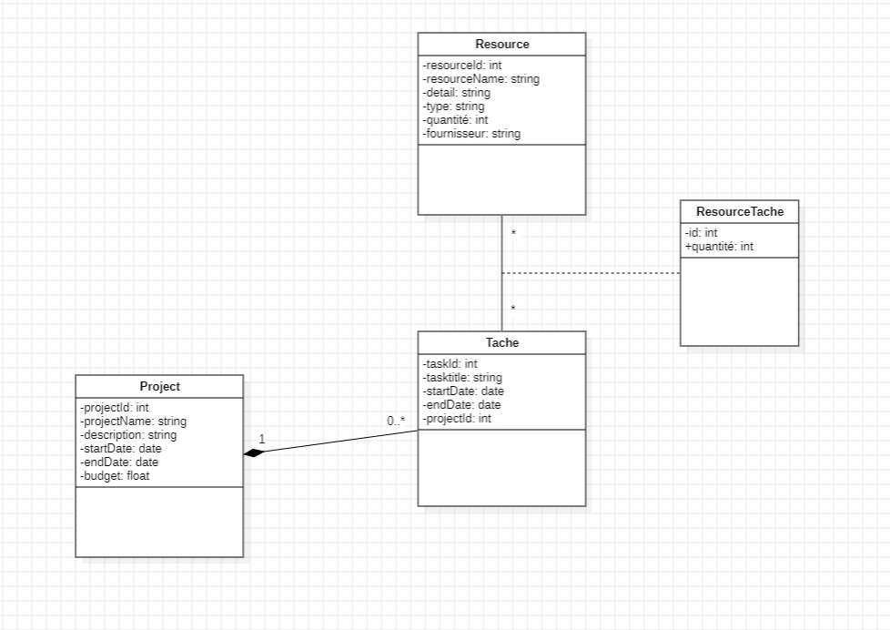
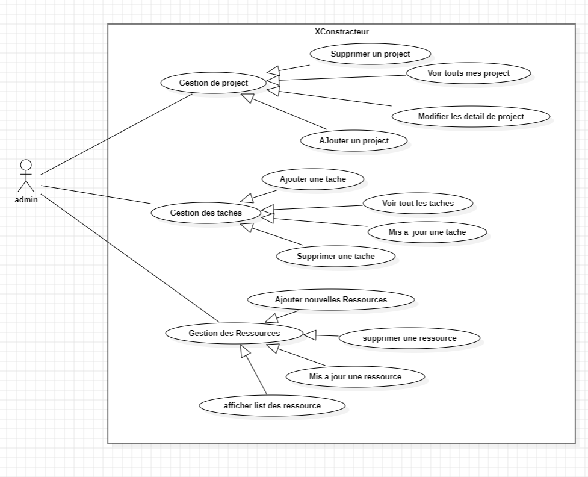
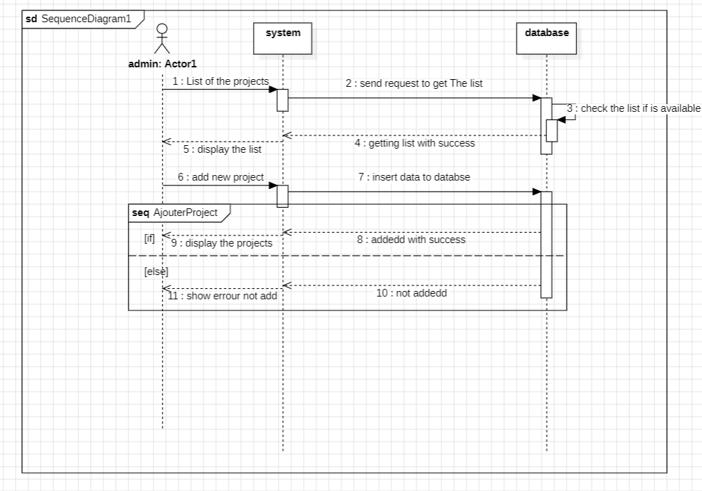

# ConstructionXpert Services 🏗️

### **Solution**: Application de Gestion de Projets de Construction

---

## 📜 **Description**

**ConstructionXpert Services** est une **application web** qui permet à l'équipe de construction de **créer et de gérer des projets de construction**, d'assigner des tâches aux membres de l'équipe, de gérer les ressources nécessaires et de suivre les détails des projets et des tâches. Elle fournit une interface conviviale pour visualiser, mettre à jour et supprimer des projets. Chaque projet peut avoir plusieurs tâches, et chaque tâche peut avoir des ressources spécifiques.

---

## 🎯 **Contexte du projet**

En tant que **développeur full-stack freelancer**, vous êtes sollicité pour créer une **application de gestion de projets de construction** pour l'entreprise **"ConstructionXpert Services"**. L'objectif est de fournir à l'équipe de construction un outil efficace pour planifier et organiser les projets de construction.

---

## 🛠️ **Fonctionnalités**

En tant qu'administrateur, vous pouvez :

### **Gestion des Projets**
- **Créer un projet** : Ajouter un nouveau projet en spécifiant son nom, sa description, sa date de début, sa date de fin et son budget.
- **Lister les projets** : Afficher la liste des projets existants avec leurs détails.
- **Mettre à jour un projet** : Modifier les détails d'un projet existant.
- **Supprimer un projet** : Supprimer un projet existant.

### **Gestion des Tâches**
- **Créer une tâche** : Ajouter une nouvelle tâche pour un projet en spécifiant sa description, sa date de début, sa date de fin, et les ressources nécessaires.
- **Lister les tâches** : Afficher la liste des tâches associées à un projet avec leurs détails.
- **Mettre à jour une tâche** : Modifier les détails d'une tâche existante.
- **Supprimer une tâche** : Supprimer une tâche existante.

### **Gestion des Ressources**
- **Ajouter des ressources** : Ajouter de nouvelles ressources avec leurs détails (nom, type, quantité, fournisseur).
- **Lister les ressources** : Afficher la liste des ressources disponibles avec leurs détails.
- **Mettre à jour une ressource** : Modifier les détails d'une ressource existante.
- **Supprimer une ressource** : Supprimer une ressource existante.
- **Mettre à jour la quantité** : Modifier la quantité après chaque assignation à une tâche.

### **Bonus**
- **Connexion et déconnexion** : L'administrateur peut se connecter et se déconnecter de l'application.
- **Protection des pages** : Accès limité aux pages après la connexion de l'administrateur.
- **Gestion des fournisseurs** : L'administrateur peut gérer les fournisseurs.

---

## 🧑‍💻 **Technologies et Outils Utilisés**

### **Backend**
- **Langage de Programmation** : Java
- **Framework Web** : Java EE (Servlets, JSP)
- **Base de Données** : MySQL/PostgreSQL
- **JDBC API** : Pour la communication entre l'application Java et la base de données
- **Serveur d'Application** : Apache Tomcat

### **Frontend**
- **HTML**, **CSS** (Bootstrap/Tailwind)
- **JavaScript** pour l'interactivité

### **Autres Outils**
- **Système de Gestion de Versions** : Git
- **Maquettes** : Figma/Adobe XD

---

## 🎨 **Conception**

### Diagrammes UML :
1. **Diagramme de Classes**
  
2. **Diagramme de Cas d'Utilisation**

3. **Diagramme de Séquence** 

---


## 🧰 **Installation et Démarrage**

### **Prérequis**
- **Java** >= 8
- **MySQL/PostgreSQL** installé et configuré
- **Node.js** (si le frontend utilise du JavaScript pour la gestion des dépendances)

### 1. **Clonez le projet depuis GitHub**
```bash
git clone https://github.com/mohamed-iaazi/XConstracteure.git
cd XConstracteure
